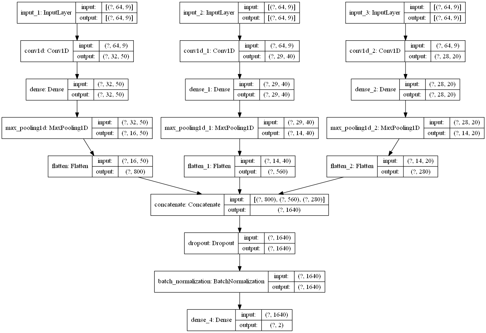

# FoG_classification
This project is oriented on creating a deep learning model which would be able to determine the Freezing of Gait intervals from given sensor based data by segmenting them into frames which include 64/256 rows (1/4 seconds of data, whilst each new row iterates by 15 milliseconds). That's why I used the convolutional 1D neural network which specifies on sensor based data and can easily achieve outstanding performance in no time. 
## Used libraries
In order to create this model I've used several of them:
* [keras](https://pypi.org/project/Keras/)
* [scikit-learn](https://scikit-learn.org/stable/install.html)
* [scipy](https://www.scipy.org/install.html)
* [pandas](https://pandas.pydata.org/pandas-docs/stable/getting_started/install.html)
* [os](https://www.geeksforgeeks.org/os-module-python-examples/)
* [numpy](https://numpy.org/install/)
## Overall performance
It's worth mentioning that the model trained on 64 framed segments has achieved much better results than the 256 alterntaive. Each .txt data file has 10 features, where the last one(activity) has to be predicted. There were 3 sensors which measured the movement of every patient in X Y Z axis. While those sensors were being attached, the activity value was set to 0, meaning that there has not yet been detected any movement. Activity 1 stands for normal walking, where no freezing episodes are present. Finally, Activity 2 indicates that the patient is suffering from Freezing of Gait and can't move properly.
## Model structure
The proposed model consists out of three independant convolutional layers, which are then merged together. To avoid overlapping on the training phase, callbacks and optimization parameters were used. Finally, the trained model is saved and tested on small parts of data, which contain only 256 rows without the last feature in order to simulate the models behaviour, if those were real time data.
## Used software
This project was created using:
* [Anaconda](https://www.anaconda.com/products/individual)
* Spyder (Python 3.8)
## Visualised model structure

